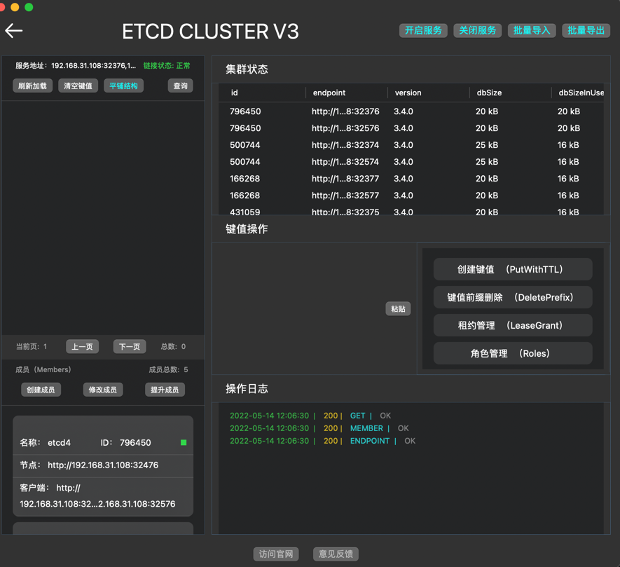

[简体中文](./README.md) | English

---

---

[![MPLv2 License][6]][7]
[![Discord invite][8]][9]
[![Docs site][5]][3]
[![Latest Mac Download][10]][2]

# etcdWp
**etcdWp** is a free etcd client desktop that supports Macos desktop **(Mac Version >= 11.0)**. Supports operations such as adding, deleting, modifying, and querying key-value stores of etcd stand-alone and cluster versions. At the same time, it also increases the operations on etcd cluster resources and members.

# Feature Support

- [X] Support adding, deleting, modifying, viewing.
- [X] Support batch export and batch import of key values. 
- [X] Support adding, deleting, modifying and viewing leases. 
- [X] Supports adding, deleting, modifying and viewing cluster members. 
- [X] Support adding, deleting, modifying, viewing for users.
- [X] Support to display cluster resources, leader status.
- [X] Support key-value tiling and tree structure display. 
- [X] Added etcd operation log display.

# Quick Start

- **[Example of using ETCDWP stand-alone version](https://github.com/workpieces/etcdWp/blob/main/test/SINGLE.md)**
- **[Example of using ETCDWP Cluster Edition](https://github.com/workpieces/etcdWp/blob/main/test/CLUSTER.md)**
- **[ETCD certificate production example](https://github.com/workpieces/etcdWp/blob/main/cert/README.md)**

# Main Interface View

# Download

- **[Apple Store Download][1]**
- **[DMG Download][2]**

# Documentation

- **[ETCDWP Working with documentation][3]**

[1]: https://apps.apple.com/cn/app/etcdwp/id1617626187?mt=12
[2]: https://github.com/workpieces/etcdWpSite/releases
[3]: https://github.com/workpieces/etcdWp/blob/main/WIKI.md
[4]: https://github.com/workpieces/etcdWpSite/blob/main/LICENSE
[5]: https://img.shields.io/badge/Docs-Learn%20more-ffc7c7
[6]: https://img.shields.io/badge/license-MPLv2-blue.svg?style=flat-square
[7]: https://www.mozilla.org/MPL/2.0/
[8]: https://img.shields.io/badge/Discord-Come%20and%20chill-blue
[9]: https://github.com/workpieces/etcdWpSite/issues
[10]: https://img.shields.io/teamcity/https/build.syncthing.net/s/Syncthing_BuildMac.svg?style=flat-square&label=mac+build
[11]:https://github.com/workpieces/etcdWp/wiki