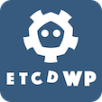

---

[![MPLv2 License][6]][7]
[![Discord invite][8]][9]
[![Docs site][5]][3]
[![Latest Mac Download][10]][2]

# etcdWp

**etcdWp**是一款免费且支持Macos桌面的etcd客户端桌面 **(Mac Version >= 11.0)**。支持对etcd单机版和集群版键值存储做增删改查等操作。
同时，也增加对etcd集群资源和成员操作。

# 功能支持

- [X] 支持增加,删除,修改,查看。
- [X] 支持对键值批量导出,批量导入。
- [X] 支持对租约增加,删除,修改,查看。
- [X] 支持对集群成员增加,删除,修改,查看。
- [X] 支持对用户增加,删除,修改,查看。
- [X] 支持显示对集群资源,leader状态。
- [X] 支持键值平铺及树形结构展示。
- [X] 增加对etcd操作日志显示。

# 快速开始

- **[ETCDWP单机版使用示例](https://github.com/workpieces/etcdWp/blob/main/test/SINGLE.md)**
- **[ETCDWP集群版使用示例](https://github.com/workpieces/etcdWp/blob/main/test/CLUSTER.md)**

# 主界面视图

# 下载

-  **[苹果商店下载][1]**
-  **[DMG下载][2]**

# 使用文档

- **[请参阅ETCDWP操作文档使用][3]**
- **[请参阅ETCDWP说明文档使用][11]**

[1]: https://apps.apple.com/cn/app/etcdwp/id1617626187?mt=12
[2]: https://github.com/workpieces/etcdWpSite/releases
[3]: https://github.com/workpieces/etcdWp/blob/main/WIKI.md
[4]: https://github.com/workpieces/etcdWpSite/blob/main/LICENSE
[5]: https://img.shields.io/badge/Docs-Learn%20more-ffc7c7
[6]: https://img.shields.io/badge/license-MPLv2-blue.svg?style=flat-square
[7]: https://www.mozilla.org/MPL/2.0/
[8]: https://img.shields.io/badge/Discord-Come%20and%20chill-blue
[9]: https://github.com/workpieces/etcdWpSite/issues
[10]: https://img.shields.io/teamcity/https/build.syncthing.net/s/Syncthing_BuildMac.svg?style=flat-square&label=mac+build
[11]:https://github.com/workpieces/etcdWp/wiki

