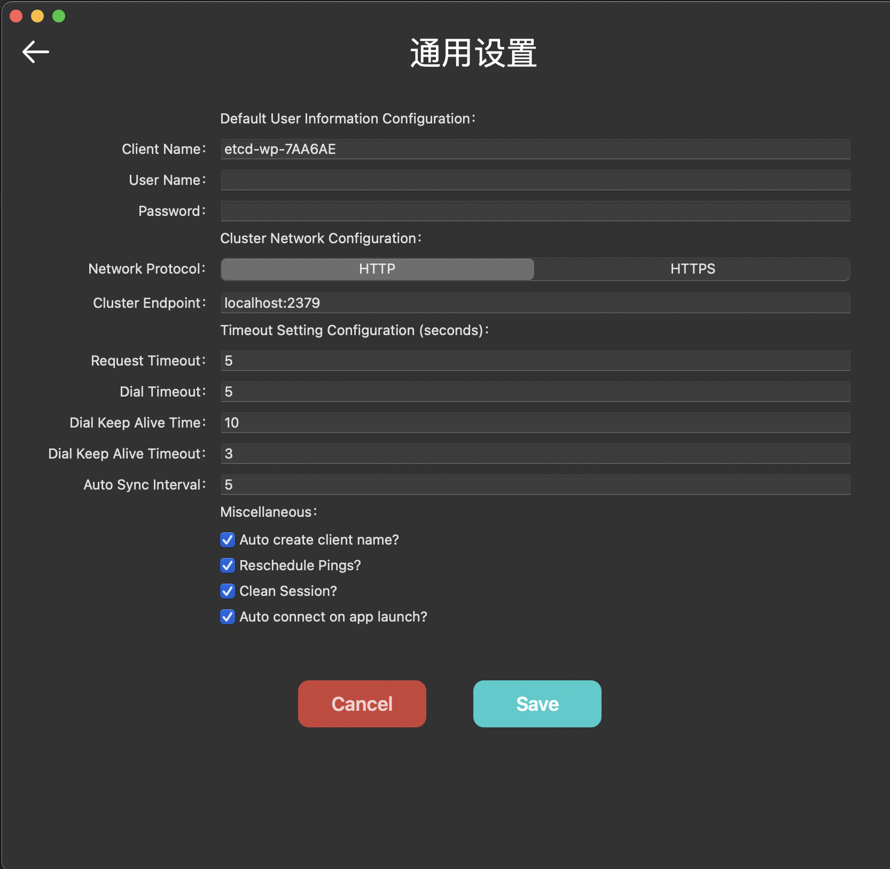
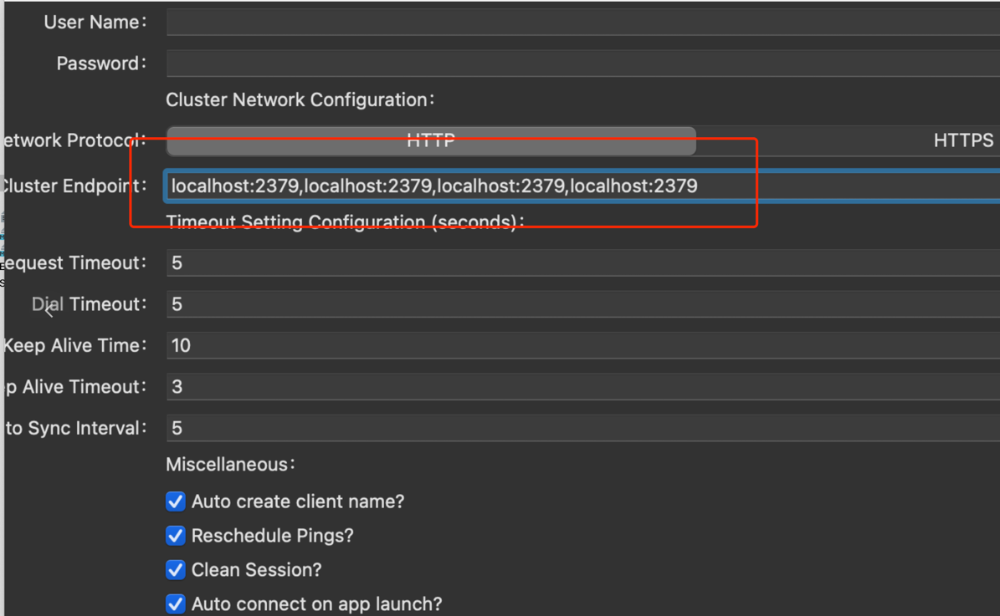
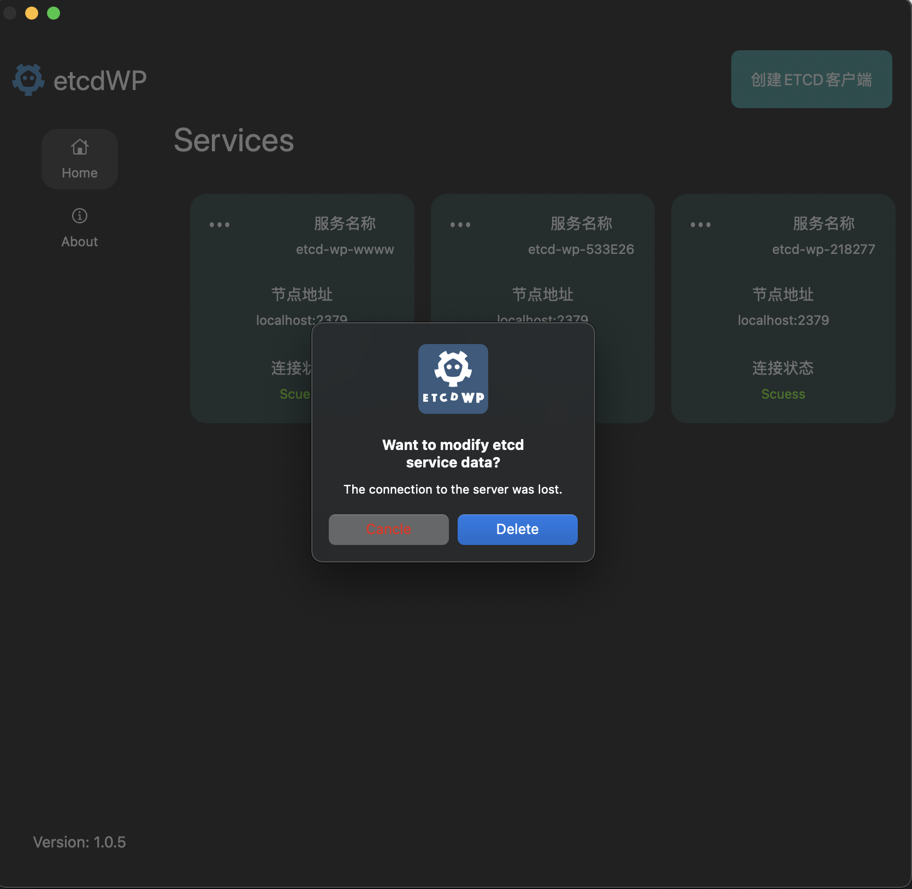

# 使用手册

## 一、创建etcd客户端

#### 1.1 创建etcd客户端 (单机版Endpoints)

#### 1.2 创建etcd客户端（集群版多个Endpoints）

**注意：多个Endpoints使用逗号`,`分割**

#### 1.3 添加HTTPS证书

#### 1.4 相关参数介绍

## 二、删除etcd客户端

## 三、键值相关

#### 3.1 键值查看

#### 3.2 键值修改

#### 3.3 键值删除

#### 3.4 键值Value拷贝

## 四、成员相关

## 五、集群资源相关

## 六、租约相关

## 七、用户相关

## 八、批量导入导出

## 九、角色管理

