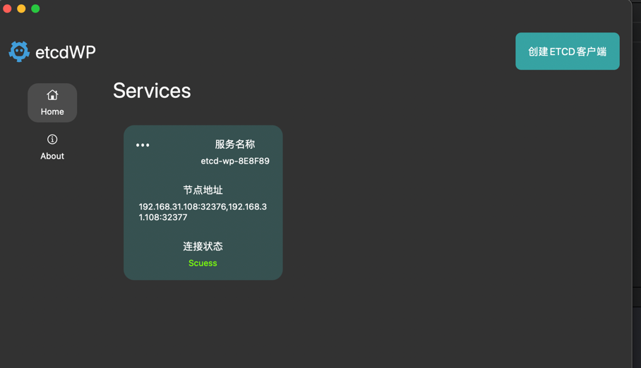

# 集群测试

## Docker启动服务

注意：`.env`中添加自己当前主机ip。

Mac获取当前主机ip:


```shell
docker-compose -f cluster.yaml up -d
```

## 连接测试




## 添加键值测试

如果服务显示异常，可点击`开启服务`按钮。


## 证书测试

- https://thenewstack.io/tutorial-set-up-a-secure-and-highly-available-etcd-cluster/

