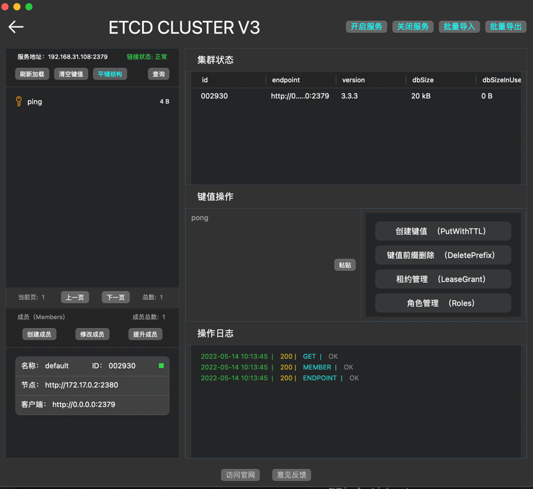

# 单机版etcd测试

## Docker启动服务

```shell
docker run -d -p 2379:2379 -p 2380:2380 appcelerator/etcd --listen-client-urls http://0.0.0.0:2379 --advertise-client-urls http://0.0.0.0:2379
```

## 连接测试


## 添加键值测试



## 证书测试

