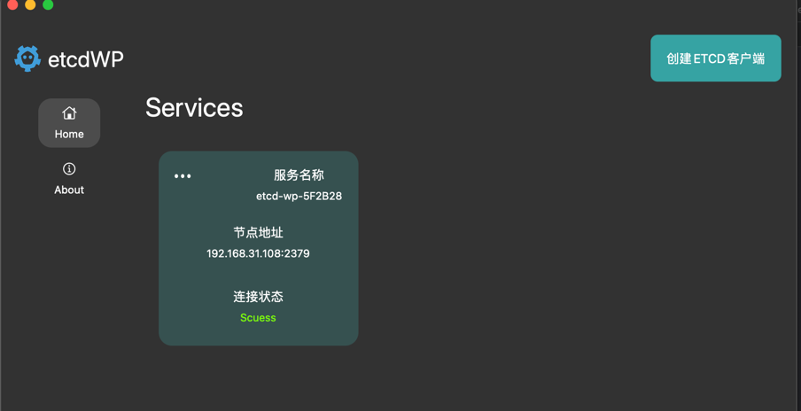
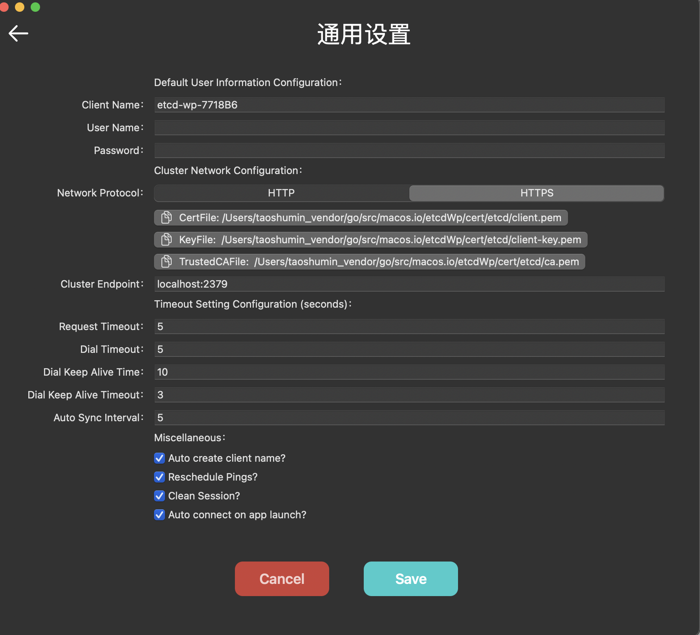

# 单机版etcd测试

## Docker启动服务

```shell
docker compose -f single.yaml up -d 
```

## 连接测试



## 添加键值测试


## 证书测试

- [证书制作参考](https://github.com/workpieces/etcdWp/blob/main/cert/README.md)

证书对应:

```go
tlsInfo := transport.TLSInfo{
  CertFile:      "/tmp/test-certs/test-name-1.pem",
  KeyFile:       "/tmp/test-certs/test-name-1-key.pem",
  TrustedCAFile: "/tmp/test-certs/trusted-ca.pem",
 }
```



